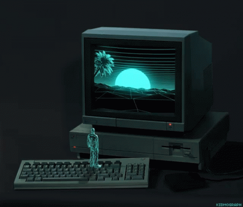

<h1 align="center">Hi 👋, I'm Kaan Bouldoires</h1>

  

 

---

## 🚀 About Me:
- 🎯 Passionate about **full-stack development** & **project engineering**
- 🔭 Currently working on innovative solutions
- 📚 Always learning new technologies & improving skills

---

## 🛠️ Languages and Tools:

<a href="https://fr.wikipedia.org/wiki/JavaScript" target="_blank"> 
<a href="https://www.typescriptlang.org/" target="_blank"> 
<a href="https://www.python.org" target="_blank"> 
<a href="https://www.java.com/fr/" target="_blank"> 
<a href="https://go.dev/" target="_blank"> 
<a href="https://www.docker.com/" target="_blank"> 
<a href="https://www.php.net" target="_blank"> 
<a href="https://www.rust-lang.org/fr" target="_blank"> 
<a href="https://www.postgresql.org/" target="_blank"> 
<a href="https://www.mysql.com/" target="_blank"> 
<a href="https://www.cprogramming.com/" target="_blank"> 
<a href="https://cplusplus.com/" target="_blank"> 
<a href="https://www.lua.org/" target="_blank"> 
<a href="https://www.haskell.org/" target="_blank"> 
<a href="https://www.gnu.org/software/bash/" target="_blank"> 
<a href="https://www.w3.org/html/" target="_blank"> 
<a href="https://www.w3schools.com/css/" target="_blank"> 
<a href="https://git-scm.com/" target="_blank"> 
<a href="https://gitlab.com/" target="_blank"> 
<a href="https://www.linux.org/" target="_blank"> 

---

## 📊 GitHub Stats:

  

---

## 🏆 GitHub Trophies:

  

---

## 📩 Contact Me:

---

⭐️ **Always open to collaboration & exciting projects!**
